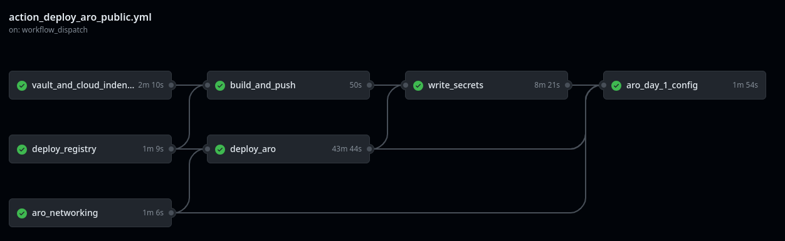
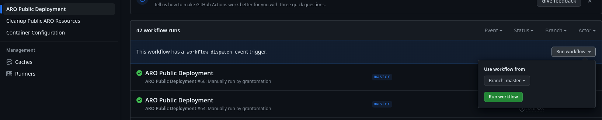

# Azure Red Hat OpenShift (ARO) - Publicly Accessible Deployment

This repo will guide you through the process of deploying an Azure Red Hat OpenShift (ARO) cluster in Azure. The cluster will be accessible via the Internet and therefore no firewall or additional Azure network security features will be deployed, just the ARO cluster and the cloud resources used to configure it.

If you are looking for an Azure Landing Zone Implementation of ARO then please see the following repo [Azure Red Hat OpenShift (ARO) Landing Zone Automated Deployment](https://github.com/grantomation/azure-red-hat-openshift-landing-zone)



ARO is a first party service on Azure which means that it's part of the Azure API, as such I have purposely created this repo using tooling that is familiar to Azure customers to prove that ARO can be integrated into Azure environments the same way that they can deploy their other Azure resources. It is designed to take customers from nothing to a publicly accessible ARO cluster as the destination for containerised workloads.

# High Level Architecture
Let's start by looking at the High level architecture. Aligning with Azure's landing zone implementation the deployment creates three resource groups;

* A Resource group
  * Contains Azure Red Hat OpenShift (ARO).

# Resource Details
[Click Here](./docs/resource_details.md) for a description of the Azure Red Hat OpenShift Landing Zone Resources.

# Workflow Job Details
[Click Here](./docs/workflow_details.md) for a description of the Azure Red Hat OpenShift Landing Zone deployment Github actions workflow jobs.

# General Deployment Workflow

* Copy this repo to a private repo of your own
* Create a Github personal access token
* Create an Azure Application Registration/Service principal 
* Create a resource groups and grant the Azure Service Principal `Contributor` and `User Access Administration` permissions scoped to these resource groups.
* Create Github repository secrets and variables (use the helper script to make it easy)
* [Run the Github actions workflow](./docs/workflow_details.md)
* Log into Azure Red Hat OpenShift using your Azure EntraID Directory account

# Pre-requisites

## Required Software
* az command line
* jq
* curl
* gh command line

## Make a copy of this repo on Github
Make a copy of this repo to your Github account, ensure that it is a private repo, this wil prevent accidental leaking of secrets and avoid anyone from the public running the Github actions workflow.

> **Warning** 
> Please be careful about how you store secrets. It is advised to use a private repo to ensure that there is a less chance of private data exposure.

## Create a Github Personal Access Token
The Github Personal access token is injected as a secure environment variable into the Github runner container which is used in the workflow so that it can register itself to your Github repository as a runner and poll for jobs.

* Create a personal access token
  * Github > User Settings > Developer Settings > Personal access tokens (or https://Github.com/settings/tokens)
  * Set an expiry and add a note 'used for ARO deployment'
  * Grant permissions for "repo", "workflow", "admin:org", "admin:public_key"
  * Save the token
  * Run the following command `gh auth login` and paste in the token
  * Github.com, SSH, \<Select SSH Key\>, Paste an authentication token
  * Insert the PAT as a Github secret as per the "secrets" table below "PAT_Github"

## Create EntraID Security Group
Create an EntraID Security Group which will contain the users that will be administrators for Azure Red Hat OpenShift (ARO). You will need to place the 

```console
export SG_NAME="<insert name of security group for openshift administrators>"

az ad group create --display-name "$SG_NAME" --mail-nickname "mysecuritygroup" --security-enabled true

az ad group list --filter "displayName eq 'SG_NAME'" --query "[].objectId" --output tsv
```

## Create Red Hat pull secret 
For an Azure Red Hat OpenShift (ARO) cluster deployment, a Red Hat pull secret is still needed to download and use Red Hat images for Operators found in the Operator Hub. A pull secret is essentially an authentication token that provides access to Red Hat's registry, which contains container images and other software packages. If you do not have a pull-secret from Red Hat already then please browse to [cloud.redhat.com](https://cloud.redhat.com) to create one. The Red Hat pull secret will be used as a Github repository secret.

Place the Red Hat pull secret in a file called `pull-secret.json` at the root of this repo to ensure that the helper scripts can read it and write it to Github repository secrets for use in the Github actions workflow.

## Create an Azure App Registration/Service Principal

For this repo an Azure app registration/service principal is required. It has a few uses;

1. *Deploying ARO* - An app registration/service principal is needed to provide secure access to Azure resources that are required to deploy and manage an ARO cluster. A app registration/service principal is essentially an identity for your ARO cluster that allows it to access and manage Azure resources such as virtual networks, storage accounts, and other resources required by the cluster. By creating an app registration/service principal, you can grant your ARO cluster the necessary permissions to access and manage Azure resources without giving it full access to your entire Azure subscription.

2. *Deploy Resources to Azure using Github actions* - The Azure service principal is used by Github Actions to authenticate and authorize the deployment of your code to Azure resources. This allows Github Actions to perform actions such as creating or updating resources, deploying code to virtual machines, and more. The permissions that are granted to the service principal are `Contributor` and `User access admin` scoped to the three resource groups that are created.
- `Contributor` permits resource creation
- `User access admin` permits adding the Azure Red Hat OpenShift Resource Provider the appropriate permissions during the Azure installation.

3. *OIDC Login for GitHub Actions* With OpenID Connect (OIDC), you can configure your workflow to request a short-lived access token directly from the cloud provider. Your cloud provider also needs to support OIDC on their end, and you must configure a trust relationship that controls which workflows are able to request the access tokens. Providers that currently support OIDC include Amazon Web Services, Azure, Google Cloud Platform, and HashiCorp Vault, among others.

4. *Credentials for ARO to use Entra as identity provider* - During the configuration of the OpenShift identity provider the Azure service principal is used.

Set the name for the EntraID App Registration/Service Principal

```console
export DISPLAYNAME="<Desired Entra App Registration/Service Principal name>"
```
Now create the app registration and the service principal. We will also start to configure
```
az ad app create --display-name=$DISPLAYNAME --sign-in-audience AzureADMyOrg --optional-claims "{\"idToken\":[{\"name\":\"preferred_username\",\"source\": null,\"essential\": false,\"additionalProperties\":[]},{\"name\":\"email\",\"source\": null,\"essential\": false,\"additionalProperties\": []}]}"

export AAD_APP_CLIENT_ID=$(az ad app list --filter "displayname eq '$DISPLAYNAME'" --query '[].appId' -o tsv)
echo $AAD_APP_CLIENT_ID

az ad sp create --id $AAD_APP_CLIENT_ID

```

- Now create a password for the App Registration / Service Principal
```
export AAD_CLIENT_SECRET=$(az ad app credential reset --id $AAD_APP_CLIENT_ID --query password -o tsv)
```

- Now run gh_secrets_create.sh to populate github values (YOU WILL NEED TO READ/CREATE GITHUB PERSONAL ACCESS TOKEN FIRST)
```
gh api user -q .login
gh auth logout
gh auth login
gh api user -q .login 
```
Select the following options
- Github.com
- HTTPS
- Paste your authentication token

You should see output like the following
```
- gh config set -h github.com git_protocol https
✓ Configured git protocol
✓ Logged in as grantomation
```

## Set Helper Script Variables
Set the following variables in the file `helper_vars.sh` to ensure that the helper scripts can run sucessfully.

| Helper Var Name | Description |
| --- | --- | 
| DISPLAYNAME | The name for the App registration/service principal that you created above. | 
| GH_REPO | Your copy of this github repository (private) where you are running this code from. |
| GH_ORGANISATION | Your github username (or organisation). |
| GH_BRANCH | Set the branch where you will run the github actions from (default `master`)  | 
| PAT_GITHUB | The Personal Access Token for Github that you created above |
| LOCATION | Azure Region where cloud resources will be deployed | 
| PUB_RG | The name of the resource group which will hold Azure Red Hat OpenShift (ARO) |
| AAD_ADMIN_GROUP_ID | The ID of the Azure EntraId Security Group. Get ID by running the following command `az ad group show -g <AAD GROUP NAME> --query id -o tsv` | 
| CONTAINER_BUILD_NAME | The name and tag for the Github runner container that is build default `aro-github-runner:1` | 

All other variables in this file will be determined via lookup commands using `az` cli

## Set Parameters and Variables for your environment

1. Modify the parameters found in `./action_params/*.json` to suit your Azure environment.

The following parameter names require unique names - so please be mindful of this;

| Cloud Resource | Parameter Name | Location in Code |
| --- | --- | --- |
| Storage Account | `storageAccountName` | `action_params/storage.parameters.json` |
| Azure Container Registry | `acrName` | `action_params/acr.parameters.json` |
| Azure Keyvault | `keyVaultName` | `action_params/keyvault.parameters.json` |
| Azure Red Hat OpenShift (ARO) Domain | `domain` | `action_params/aro.parameters.json` |

## Register Azure Providers
The following Azure services need to be registered prior to deployment;

```console
az provider register -n Microsoft.RedHatOpenShift
az provider register -n Microsoft.Storage
az provider register -n Microsoft.KeyVault
az provider register -n Microsoft.Compute
az provider register -n Microsoft.ContainerRegistry
az provider register -n Microsoft.Cdn
az provider register -n Microsoft.ContainerInstance
az provider register -n Microsoft.OperationalInsights
az provider register -n Microsoft.Insights

```

## Set the appropriate quota for your environment

By default ARO uses a minimum 40 cores and this will need to be accounted for in the Azure Quota. 

Default virtual machine types for ARO are "Standard D4s v3" machines.

# Run the helper scripts

### <a id="Github-secrets"></a>Create the Github Repository Secrets and Variables

> :warning: Remember to log in to the `gh` cli tool prior to the `gh_secrets_create.sh` helper script.

Github repository secrets are encrypted environment variables that you can store in a repository on Github. These secrets are used to store sensitive information that is required by your Github Actions workflows, such as API keys, access tokens, and other secrets. Github Actions repository variables are environment variables that you can define for a specific repository in Github. These variables can be used in Github Actions workflows to store values that are specific to that repository.

Ensure that you are logged in to the Azure CLI with a user that has appropriate permissions and execute the following commands;

```console
chmod +x helper_vars.sh
chmod +x gh_secrets_create.sh

./gh_secrets_create.sh

```

### Run Resource Group creation
Prior to running the workflow a user with the appropriate permissions must create the initial resource groups with correct permissions for the App registration/service principal.

Run `./pub_rg_create.sh` to perform these actions for you.

```
chmod +x pub_rg_create.sh
./pub_rg_create.sh
```

# Run the Github actions Azure Red Hat OpenShift Landing Zone workflow

To run the Github actions to deploy the environment select the following;



# Github actions workflow Resource Cleanup

To complete a full cleanup of Azure resources execute the delete helper script `./lz_rg_delete.sh` which will run resource group delete commands for you. You will need to change the variables at the top of the file to suit your environment.

An azure keyvault stays in a deleted state for approximately 90 days after deletion. This script will also purge the keyvault to ensure that there are no failures on the next ARO deployment.

These values can be set in the `action_params/aro.parameters.json` file in the `controlPlaneVmSize` and `computeVmSize` parameters.

# **Pull Requests are welcome!**