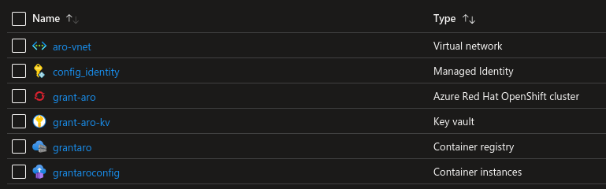

##  Public Resource Group

### Virtual Network
ARO requires two subnets created in a virtual network. These subnets host the OpenShift control plane and compute nodes.

###  Managed Identity
A managed identity is created so that resources like the Azure container instances (Github runner) have RBAC access to the keyvault in order to retrieve secrets and configuration files essential to day 1 configuration.

###  Azure Container Instances (Github Runner)
This will start a self-hosted github runner which will poll the github repo for jobs to execute. The container instances are associated with the [managed identity](#managed-identity) which, using RBAC will permit access to secrets in the [keyvault](#keyvault).

### Azure Red Hat OpenShift (ARO)

Creates the Azure Red Hat OpenShift (ARO) cluster. The typical cloud resources that make up the OpenShift cluster (virtual machines, loadbalancers etc) are deployed to a separate resource group which is restricted by a deny assignment. This means you can view the resources that make up the cluster however the majority of resource customisations that you would perform via the Azure API have been blocked. This is designed to ensure that SRE can keep a baseline to ensure that they can maintain the SLA uptime of 99.95%. Any modifications to cloud resources will need to be made via the OpenShift API once ARO has provisioned.

#### *Azure Active Directory Identity Provider*

As a Day 1 integration the ARO cluster is configured with [Azure Active directory](../README.md#aad-oauth) as the Identity provider. Users of ARO will log into the cluster using their Azure Active directory credentials. By using Azure Active Directory, group claims can be extended into the OpenShift cluster and used for RBAC.

#### *Deployed Operators from OpenShift OperatorHub*
* (Optional) Web terminal
  * The web terminal operator provides a terminal session for OpenShift in the browser. You will be able to interact with the OpenShift cluster using the openshift cli tool 'oc'.

#### *Sample web application*
A sample web application is deployed.

###  Keyvault
A keyvault is created which will store the secrets required by the deployment. These include secrets such as the ARO kubeadmin password and the API endpoint. Again, the [azure container instance](#aci) will use the [managed identity](#managed-identity) to gain access to these secrets.

###  Azure container Registry
The container registry holds the [GitHub Runner container](./workflow_details.md#container) that is used when an [Azure container instance](#aci) is deployed to configure ARO.