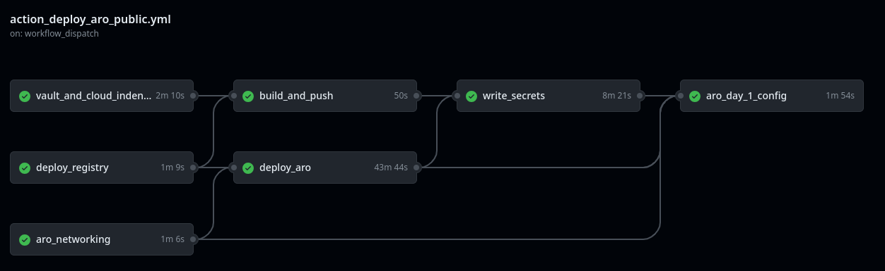

## vault_and_cloud_identity

1. Deploys a Keyvault to store secrets for the day 2 ARO configuration. Permits managed idnetity access.

2. This job also creates a user defined managed identity used for credentialess access to private resources and other Role Based Access Control (RBAC).

Outputs the managed identity resource name, clientId and principalId for future use in the workflow, as well as the keyvault uri and keyvault name for future use in the workflow.

## deploy_registry

This job deploys a publicly accessible container registry which will be the destination for the Github runner container build.

Outputs the login server address, the name of the container registry and the SKU name for future use in the workflow.

## aro_networking

Creates the virtual network for the resource group. The following subnets are created and configured for Azure Red Hat OpenShift;

* control plane subnet - disabled private link service policies, adds a service endpoint for Azure Container Registry
* compute subnet - disabled private link service and endpoint policies, adds a service endpoint for Azure Container Registry

Outputs the virtual network name and the compute subnet name for future use in the workflow.

## build_and_push

Uses Docker to build the push the container to the Azure container Registry via the publicly accessible endpoint.

###  Github Runner Container
The Dockerfile builds the [GitHub Runner container](#container). This container is built on top of the Red Hat Universal Base Image (UBI) and includes relevant tooling such as the azure cli, the openshift cli, the github runner code and other linux tools. When started the container runs the `runner_entrypoint.sh` script which starts the GitHub runner polling service. 

## deploy_aro

Deploys the latest version available for Azure Red Hat OpenShift (ARO) in the designated region.

## write_secrets

This job writes secrets created during the Github actions workflow to the Azure Keyvault. This will ensure that secrets will be available to jobs in the workflow which configure ARO. The secrets are later retrieved using the managed identity attached to the container instance.

Additionally the yaml files used to configure OpenShift are packaged up and uploaded to the storage account on the private network, again, to be availabe to jobs in the workflow which configure resources on the private network. The secrets are later retrieved using the managed identity attached to the storage account.

## aro_day_2_config

Day 2 configuration of the OpenShift cluster (Identity providers, storage classes, or OpenShift operators) is performed on this step using the github runner. The runner uses a managed identity to get the ARO kubeadmin password and api endpoint from Azure keyvault, downloads the files from the secure storage, and then runs commands against the ARO cluster with kubernetes cluster admin privileges.

Whilst this script works for initial configuration of an ARO private cluster, for subsequent configuration it is recommended to use a kubernetes configuration tool such as Red Hat Advanced Cluster Management (RHACM) or a different Github actions workflow.